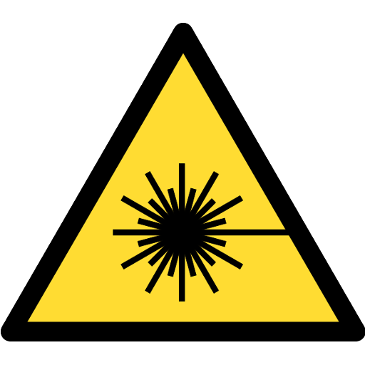

# SexyTopo

  

The SexyTopo cave and underground surveying app for Android. Next-gen surveying with a sexy interface.

This app is experimental software made available for free with no guarantee it is fit for anything in particular. I'm not responsible if it loses your data or leads you into some horrific adventure. Caving is a potentially dangerous activity etc. etc. - you know the score :)

ℹ️ There's a Facebook group for updates about SexyTopo - https://www.facebook.com/groups/sexytopo - but bug reports are easier to deal with as [GitHub issues](https://github.com/richsmith/sexytopo/issues). Other than that please email (or see me in the pub).

🏆 SexyTopo was awarded the [Arthur Butcher award](https://bcra.org.uk/detail/awards.butcher.html) for excellence in surveying by the [BCRA](https://bcra.org.uk) at [Hidden Earth](https://hidden.earth) 2023.

# Documentation

A basic [SexyTopo Manual](docs/manual.html) is available both in-app (Help → Manual) and online here.

Tarquin has also written an excellent [guide to surveying with SexyTopo](https://www.cavinguk.co.uk/info/sexytopo.html).

# FAQ

## Who are you?
Rich Smith, caver, sometime surveyor. Based in Cardiff, Wales. For other credits, see [About](https://github.com/richsmith/sexytopo/blob/main/app/src/main/res/values/about_text.xml).

## How does SexyTopo work?
SexyTopo is an app that runs on Android and talks to a laser measuring device over Bluetooth. SexyTopo builds up a skeleton of the cave using laser measurements and provides sketching tools to fill in the details. It does other things too.

## I'm interested in giving SexyTopo a go. What do I do?
You need an Android phone or tablet. The easiest way is to install SexyTopo via the Google Play app store. Just search for "SexyTopo" and click install. It's a very small download.
https://play.google.com/store/apps/details?id=org.hwyl.sexytopo

There are other options (at least until Google makes sideloading impossible):
F-Droid: https://f-droid.org/en/packages/org.hwyl.sexytopo/
APK: https://github.com/richsmith/sexytopo/releases

## What Android device is best to use with SexyTopo?
A large phone or "phablet" (as oppposed to a full-size tablet or small phone) seems to be the best form factor.
A Samsung Galaxy Note or its successor, the Ultra, is a good choice. Apart from being about the right size,
a proper stylus helps greatly in surveying. Consider buying second hand to get an affordable device for taking underground.

## What measuring instruments does SexyTopo work with?
Currently the following:

* The [DistoX2](https://paperless.bheeb.ch/) (several versions)
* The DistoX BLE
* The [Shetland Attack Pony 5](https://www.shetlandattackpony.co.uk/)
* The [Shetland Attack Pony 6](https://www.shetlandattackpony.co.uk/)
* The [Bric4](https://www.caveexploration.org/gear/bric4)
* The [Bric5](https://www.caveexploration.org/gear/bric4)
* The [Friken Cave Laser](https://frikencavelaser.com/)
* The [DiscoX](https://discox.co.uk/)
* Analogue instruments (if you input the data by hand, though not really recommended)

Please get in touch if think you can help SexyTopo work with any other instruments.

## Why... SexyTopo?
It was originally a placeholder name: a cave surveying app with a sexier interface. It now has name recognition so I probably won't get around to changing it now unless Google starts cracking down on "interesting" app names.

## How do I save / create a survey?
SexyTopo automatically creates an unsaved survey when you open it (or you select `File → New Survey` from the menu). If you save it (big save button or through the menu) then you have to create a folder for the survey to live in. Older versions of Android don't make this very easy. This is an Android-enforced change from older versions of SexyTopo. 

## Does SexyTopo need all those permissions?
Yes, even if it might not be obvious what they do. E.g. asking for certain Bluetooth permissions requires asking for location permissions (presumably you can use Bluetooth to find your location in some way). If you don't grant it everything it asks for then it may fail in unexpected ways.

## I'm interested in the SexyTopo project; can I help?
Awesome! Please get in touch. I'm interested in programmers, testers, ideas, etc.!

If you are interested in contributing code (yay), I'd ideally prefer it if you talk to me before committing. I (or someone) might already be working on that feature, or there might be some other reason why your idea hasn't made it in yet. I'm likely to be enthusiastic if you want to add a feature or fix a problem.

## I've had this problem...
Please report any bugs to the author, ideally as a GitHub issue.

If you get a crash (hopefully rare now), please make sure you connect your device to WiFi when you get a chance. A very basic error report will get uploaded if SexyTopo gets a chance (please also select "Send Error Report" for best results).

## What import / export options does SexyTopo have?
Sexytopo understands the following formats. If you are interested in helping SexyTopo understand other formats, please contact me.

### Export
I'm primarily supporting Therion and SVG as output formats. SexyTopo will try to export to other formats, but at the time of writing there are problems with them. Try them if you like.
* [Therion](https://therion.speleo.sk/)
* SVG
* Survex (data)
* PocketTopo .txt export format
* Compass

### Import
SexyTopo is primarily aimed at drawing surveys from scratch. SexyTopo will try to import other formats, but functionality is limited. Expect problems.
+ Therion (Therion files produced by SexyTopo and other simple Therion files)
+ Survex (Survex files produced by SexyTopo and other simple Survex files)
+ PocketTopo .txt export format
